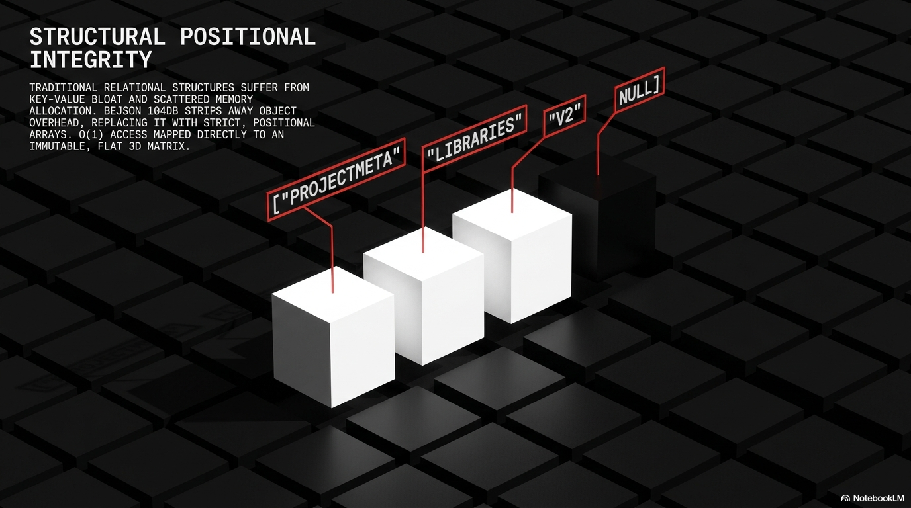

# BEJSON_INCEPTION

**AI-Native Project Snapshot & Relational Archiving for the 2026 Ecosystem**


---

## Overview

**BEJSON_INCEPTION** is a high-performance serialization and versioning engine designed for the next generation of AI-integrated development workflows. It transforms entire codebases and project directories into dense, AI-optimized BEJSON 104db payloads that can be instantly delivered to Large Language Models, Version Control Systems, or archived for transient context management.

In 2026, **context is currency.** This project provides the infrastructure to capture, version, and restore complete project states with atomic precision—enabling zero-friction collaboration between human developers and AI agents.

---

## Core Philosophy

- **Transient Context Snapshots**: Rapidly freeze project state and feed it to reasoning engines without overhead.
- **Positional Integrity**: Every file maps to a schema index for instant retrieval by AI parsers.
- **Zero-Config Operation**: Sensible defaults require no configuration; advanced users can customize via `chunker_config.json`.
- **Atomic Operations**: Prevents data corruption using validated BEJSON structures and relational integrity checks.
- **MIME Evasion**: Automatically appends `.txt` to bypass upload restrictions on AI platforms.

---

## What is BEJSON 104db?

**BEJSON** (Binary-Efficient JSON) is a tabular, AI-readable data format optimized for high-density serialization. **Format 104db** is the relational database variant, supporting:

- **Multiple Record Types**: Define entities (files, metadata, config) with a discriminator field.
- **Foreign Key Support**: Link records using `_fk` suffix convention.
- **Positional Integrity**: All fields indexed for instant lookup.
- **Binary Encoding**: Optional Base64 encoding for binary files ensures 100% fidelity during transport.

### Example BEJSON 104db Structure
```json
{
  "Format": "BEJSON",
  "Format_Version": "104db",
  "Records_Type": ["FileEntity", "MetadataEntity"],
  "Fields": [
    {"name": "record_type", "type": "str"},
    {"name": "file_path", "type": "str"},
    {"name": "content", "type": "str", "Record_Type_Parent": "FileEntity"},
    {"name": "is_binary", "type": "bool", "Record_Type_Parent": "FileEntity"}
  ],
  "Values": [
    ["FileEntity", "/src/main.py", "import sys...", false],
    ["MetadataEntity", null, null, null]
  ]
}
```

---

## Features

### Chunking (Serialization)
Convert any directory into a versioned BEJSON snapshot:
- Recursive scanning with exclusion rules.
- Lossless binary management via Base64 encoding.
- Versioned output (v1, v2, ...).
- Project registry for one-click re-chunking.

### Unchunking (Restoration)
Rebuild a complete project from a BEJSON chunk:
- Point-in-time recovery of any version.
- Binary decoding back to original files.
- Clean extraction to avoid cross-version contamination.

### Snapshot Backups (v6 Feature)
Create ZIP archives of entire MFDB projects:
- Atomic, timestamped snapshots.
- Portable archives for transfer and re-import.

### Integrity Validation (v6 Feature)
Deep semantic auditing of BEJSON files:
- Manifest-to-entity mapping.
- Row count verification.
- Structure/header validation.

---

## Single-file MFDB & Game Packaging (Important)

One of BEJSON_INCEPTION's powerful capabilities is that it can pack an entire multi-file database (MFDB) or even a complete 32-bit game (assets, binaries, levels, scripts) into a single text-file container. This is accomplished by:

- Storing every file as a record in a BEJSON 104db entity (file path, metadata, content).
- Encoding binary assets (images, audio, executables) with Base64 so they become valid text values.
- Appending a `.txt` extension when `evade_mime` is enabled so the single-file artifact can be uploaded to services that disallow certain binary extensions while remaining a fully valid BEJSON payload internally.

Use cases and examples:
- Package an entire multi-file relational snapshot into `Chunked_project_v1.104db.bejson.txt` — a single file that contains the full MFDB state for archival or AI ingestion.
- Package a 32-bit RPG (executable, sprites, maps, audio) into one text file for transport or long-term archival; unchunking will restore the original file tree and binary blobs.

Notes & limitations:
- Base64 inflates binary size (~33%); plan storage accordingly.
- Very large single files may be slower to transfer — consider splitting very large assets if distribution is necessary.
- The format preserves positional integrity and metadata so the restored project is byte-for-byte faithful when Base64-decoded.

This repository already includes example chunk files (see `Chunked_BEJSON_INCEPTION-main_v1.104db.bejson.txt`) demonstrating multi-file packing.

---

## Quick Start

### Installation
```bash
git clone https://github.com/boehnenelton/BEJSON_INCEPTION.git
cd BEJSON_INCEPTION
# Requires Python 3.8+
python3 --version
```

### Basic Usage

#### Chunk a Project
```bash
python3 CLI_Chunker.py --chunk ~/my-awesome-repo
```
Creates a timestamped BEJSON 104db file (e.g., `Chunked_project_v1.104db.bejson.txt`).

#### List Registered Projects
```bash
python3 CLI_Chunker.py --list-project-index
```

#### Re-Chunk Project by ID
```bash
python3 CLI_Chunker.py --chunk-index 1
```

#### Restore from Chunk
```bash
python3 CLI_Chunker.py --unchunk-index 1
# or restore to custom location:
python3 CLI_Chunker.py --unchunk-index 1 --dest ~/restored-project
```

---

## Command Reference

| Command | Action | Use Case |
|---------|--------|----------|
| `--chunk <DIR>` | Snapshot & Register | Initial project archival |
| `--chunk-index <ID>` | Re-Chunk | Update existing project snapshot |
| `--list-project-index` | List Projects | Discover registered projects |
| `--list-unchunk-index` | List History | View all historical chunks |
| `--get-versions <ID>` | View Versions | Inspect all versions of a project |
| `--unchunk <FILE>` | Restore File | Rebuild from a specific BEJSON file |
| `--unchunk-index <ID>` | Restore Index | Rebuild from registry history |
| `--delete-version <ID> <v>` | Prune Version | Remove specific version |
| `--expell-project <ID>` | Unregister | Remove project from registry |
| `--delete-project <ID>` | Wipe | Remove registry and delete chunks |
| `--dest <DIR>` | Custom Output | Override unchunk destination |

---

## Architecture



Layered system:
1. Input Layer — scanner & filters
2. Serialization Layer — BEJSON conversion
3. Versioning Layer — atomic writes & history
4. Registry Layer — project tracking
5. Restoration Layer — unchunking & validation

Project tree (representative)
```
BEJSON_INCEPTION/
├── CLI_Chunker.py
├── mfdb_chunker.py
├── chunker_config.json
├── BEJSON_CRASH_COURSE-v21.md
├── DOCUMENTATION.md
├── SPECIFICATION.md
├── README.md
└── BEJSON_INCEPTION_-_Slide_*.png
```

---

## Advanced Features & Config

Example `chunker_config.json`:
```json
{
  "project_name": "my-awesome-repo",
  "exclude_patterns": ["__pycache__", ".git", ".env"],
  "exclude_files": ["*.pyc", "*.log"],
  "evade_mime": true,
  "base64_binary": true,
  "max_file_size_mb": 100,
  "metadata_tags": ["production", "stable"]
}
```

- `evade_mime` appends `.txt` to chunk files for upload compatibility.
- Tag versions with metadata for easier search and audit.

---

## Visuals

Slides and diagrams included in this repo:
- BEJSON_INCEPTION_-_Slide_1.png ... BEJSON_INCEPTION_-_Slide_11.png
- The_Recursive_104db_Relational_Matrix.png

---

## Validation & Integrity

Validation passes through:
1. Structural (headers, JSON)
2. Type checking (per field)
3. Relational checks (104db discriminator & _fk links)
4. Row integrity (counts match manifest)

Validate a chunk:
```bash
python3 CLI_Chunker.py --validate <FILE>
```

---

## Use Cases

- AI agent context delivery (package and upload snapshots)
- Transient development snapshots (pre/post refactor)
- Multi-version auditing and comparisons
- Secure archival with integrity verification
- Collaborative AI workflows (share snapshot → ingest → iterate)

---

## Performance & Limits

| Metric | Value |
|--------|-------|
| Max File Size | Configurable (default 100 MB) |
| Max Project Size | Limited by disk space |
| Typical Chunking Speed | ~1 MB/sec (depends on IO) |
| Restoration Speed | ~2 MB/sec |
| Language | Python 3.8+ |

---

## Best Practices

1. Chunk regularly and before big changes.
2. Tag important versions (releases, milestones).
3. Validate after restore.
4. Exclude large generated artifacts.
5. Archive or prune old versions periodically.

---

## Troubleshooting

- Chunk file too large? Exclude large directories (node_modules/, .venv/).
- Validation failed on unchunk? Run `--validate` to inspect errors.
- Restore specific version: use `--get-versions <ID>` then `--unchunk-index <ID>`.

---

## Contributing & License

Maintained by Elton Boehnen. Issues and pull requests welcome. See repo for license details.

---

## Author & Contact

**Elton Boehnen**  
Email: boehnenelton2024@gmail.com  
Portfolio: https://boehnenelton.pages.dev  
GitHub: [@boehnenelton](https://github.com/boehnenelton)

---

**Version**: 2.5.0  
**Last Updated**: 2026-06-21  
**Status**: Production Ready

---

ALL RIGHTS RESERVED

---

**BEJSON_INCEPTION** — *Where code meets context. Where humans collaborate with AI.*
